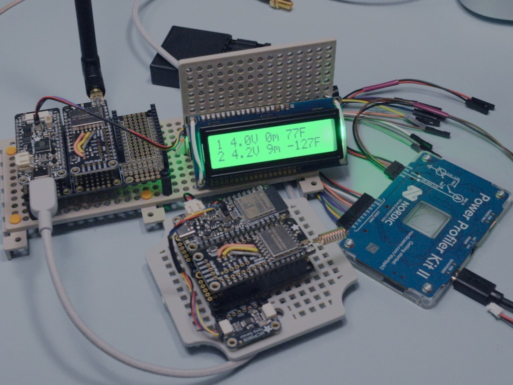

<!-- SPDX-License-Identifier: MIT -->
<!-- SPDX-FileCopyrightText: Copyright 2025 Sam Blenny -->
# LoRa Wireless Greenhouse Monitor



This is a LoRa temperature monitoring system designed to work with multiple
sensors and a base station. The base station hardware configuration is
configurable with output over USB serial, an optional 2x16 Character LCD, and
an optional ESP-NOW gateway.

The radio settings are tuned to work at a range of up to 500m in suburban or
rural conditions (non line of sight with limited obstructions). With a fully
charged 400 mAh LiPo battery and a 9 minute reporting interval, typical sensor
runtime should be about four weeks (~22µA deep sleep current, ~2667ms of time
per wake cycle, ~0.222 coulombs of charge per wake cycle).


## Related Projects

This code can be used on its own, but I built it to work closely with my
[serial-sensor-hub](https://github.com/samblenny/serial-sensor-hub) and
[irc-display-bot](https://github.com/samblenny/irc-display-bot) to monitor
temperatures with text status updates over IRC and charts over HTTP.


## LoRa Node Addresses & HMAC Keys

This project doesn't really care how many sensor nodes you use or how you
assign the addresses. But, if you want to use my serial-sensor-hub and
irc-display-bot code too, those work best with 1 to 3 sensors, using node
addresses 1, 2, and 3. For base station node addresses, you can use whatever
so long as it doesn't conflict with the sensor addresses (maybe start at 200).

Sensors and base stations use [HMAC](https://en.wikipedia.org/wiki/HMAC)
signatures with a shared key for message integrity, sender authentication, and
duplicate packet filtering. The sensors sign their temperature report packets,
which include a sequence number (derived from RTC). The base station(s) verify
the HMAC signature and check that the sequence numbers are monotonic. The
signature implementation is based on
[TOTP](https://datatracker.ietf.org/doc/html/rfc6238), but the message to be
signed includes node address, battery voltage, temperature, etc. instead of
only a UNIX timestamp.

**CAUTION**: If you reset or power cycle a sensor, you need to reset or reboot
the base station(s) to reset their sequence number checking.


## Configuration

The project code can be configured to run in several modes:
1. LoRa temperature sensor (ESP32-S3 Feather + LoRa FeatherWing)
2. LoRa base station (ESP32-S3 Feather + LoRa FeatherWing)
3. LoRa base station with ESP-NOW gateway (ESP32-S3 Feather + LoRa FeatherWing)
4. ESP-NOW base station (ESP32-S3 Feather, QT Py, or Metro)

Each sensor and base station needs to have some `CIRCUITPY/settings.toml`
values set to configure which mode to operate in, what key to use for HMAC,
what LoRa node address to use (except for the ESP-NOW base station), etc.

The HMAC key should be the same for all the sensors and base stations you want
to be able to communicate with each other. If you want more than one sensor
network without cross-talk interference, you can assign each network its own
key.


### Settings.toml for Sensor Mode

To run in sensor mode, put this stuff in your `settings.toml` file, editing the
HMAC key and node address values as needed:

```
HMAC_KEY = "YOUR HMAC PASSPHRASE GOES HERE"
BASE_MODE = 0
LORA_NODE = 1
```

### Settings.toml for Plain LoRa Base Station

To run in base station mode, put this stuff in your `settings.toml` file,
editing the HMAC key and node address values as needed:

```
HMAC_KEY = "YOUR HMAC PASSPHRASE GOES HERE"
BASE_MODE = 1
LORA_NODE = 200
LCD_BACKLIGHT = 0
ESPNOW_GATEWAY = 0
ESPNOW_RX = 0
```

If you've attached an I2C 2x16 character LCD and you want to turn the backlight
on, do `LCD_BACKLIGHT = 1`.


### Settings.toml for LoRa Base Station with ESP-NOW Gateway

To run a base station in LoRa to ESP-NOW gateway mode, put this stuff in your
`settings.toml` file, editing the HMAC key and node address values as needed:

```
HMAC_KEY = "YOUR HMAC PASSPHRASE GOES HERE"
BASE_MODE = 1
LORA_NODE = 201
LCD_BACKLIGHT = 0
ESPNOW_GATEWAY = 1
ESPNOW_RX = 0
```

If you've attached an I2C 2x16 character LCD and you want to turn the backlight
on, do `LCD_BACKLIGHT = 1`.


### Settings.toml for ESP-NOW Base Station

To run a base station ESP-NOW receiver mode (receiving packets forwarded by a
LoRa to ESP-NOW gateway), put this stuff in your `settings.toml` file, editing
the HMAC key and node address values as needed:

```
HMAC_KEY = "YOUR HMAC PASSPHRASE GOES HERE"
BASE_MODE = 1
LCD_BACKLIGHT = 0
ESPNOW_GATEWAY = 0
ESPNOW_RX = 1
```

If you've attached an I2C 2x16 character LCD and you want to turn the backlight
on, do `LCD_BACKLIGHT = 1`.


## Power Analysis


For sensor power analysis notes with screenshots from Nordic Power Profiler and
a PPK2, check out [power_analysis/README.md](power_analysis/README.md).
