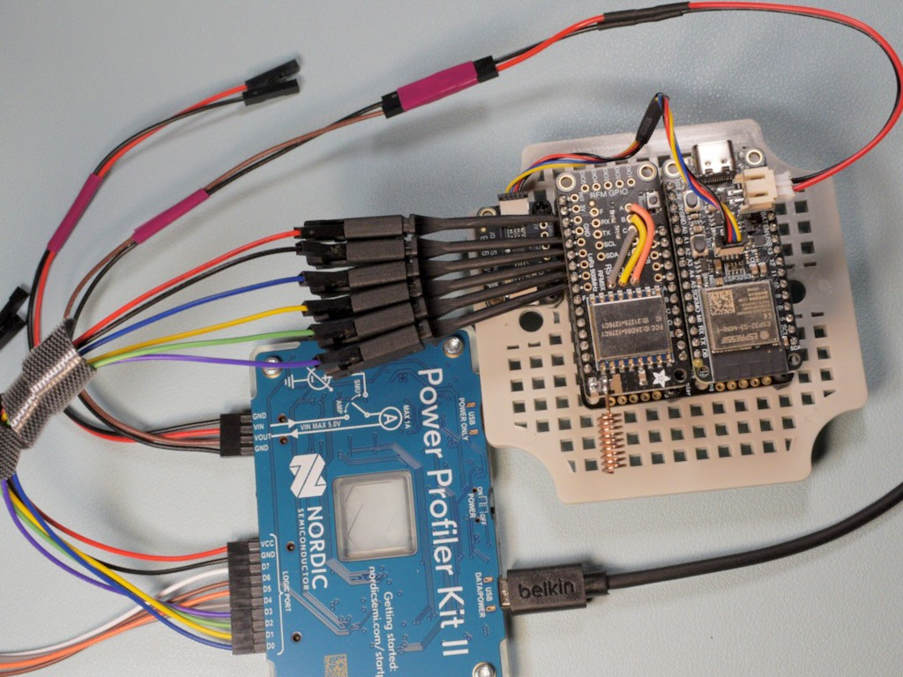
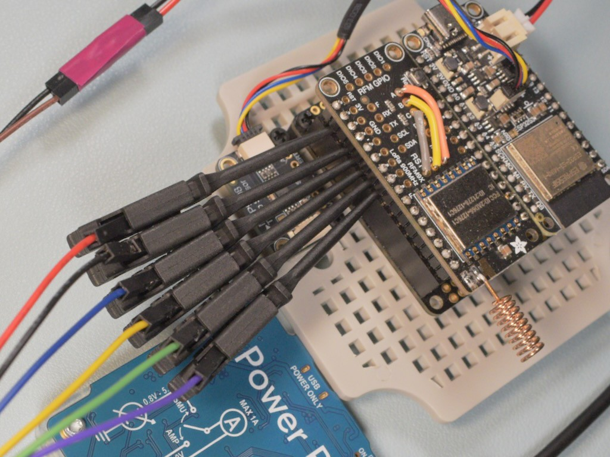

<!-- SPDX-License-Identifier: MIT -->
<!-- SPDX-FileCopyrightText: Copyright 2025 Sam Blenny -->
# LoRa Wireless Greenhouse Monitor

**DRAFT: WORK IN PROGRESS**

## Power Analysis

For sensor power analysis notes with screenshots from Nordic Power Profiler and
a PPK2, check out [power_analysis/README.md](power_analysis/README.md).
