<!-- SPDX-License-Identifier: MIT -->
<!-- SPDX-FileCopyrightText: Copyright 2025 Sam Blenny -->
# Power Analysis

These are my notes on power consumption for the code running in the sensor
configuration (ESP32-S3).


## Baseline (tag v0.2.0, commit 87ec20c)

This uses 5 second ESP32-S3 deep sleeps between wake cycles. Each wake cycle
transmits two LoRa packets at TX power 8 dB, spreading factor 9, coding rate 5,
and preamble 10, and a 10 byte payload.

Interesting features:

1. Large transient (0.9 A peak) that only appears on the initial boot. This is
   probably for bypass capacitors.

2. Smaller transient (0.7 A peak) in the middle of each boot and wake cycle.
   I'm not sure what causes this. It might have to do with either the LiPo fuel
   gauge chip or the LoRa radio module initializing.

3. Two back-to-back fuzzy-plateau sections lasting about 150 ms each with an
   average power draw of about 130 mA. These are the two LoRa packets.

4. Deep sleep current averages about 2.1 mA, which is absolutely terrible. I
   definitely need to look into this one.


### Entire PPK2 Capture (30 s)

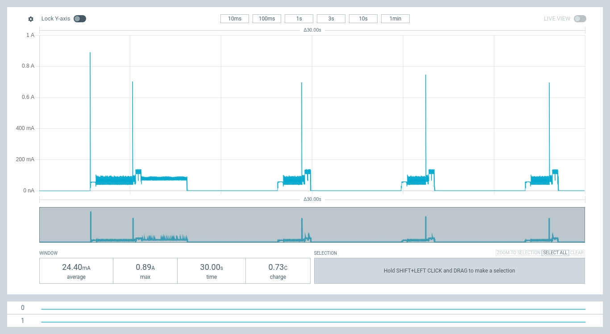


### Initial Boot Cycle


### Deep Sleep After Boot Cycle

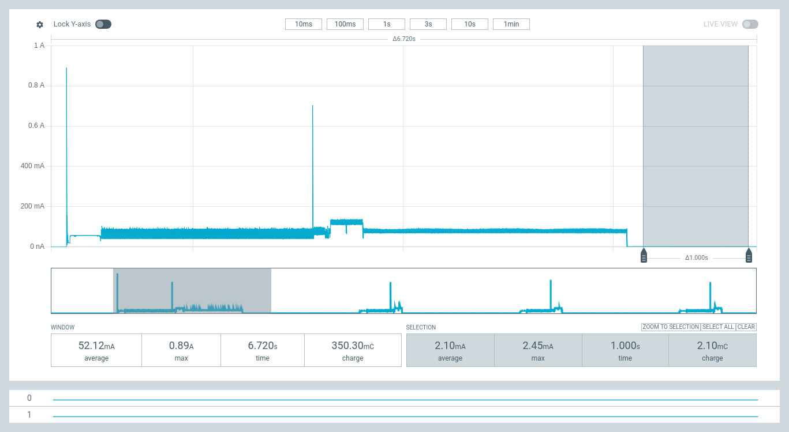


### Wake Cycle After Deep Sleep

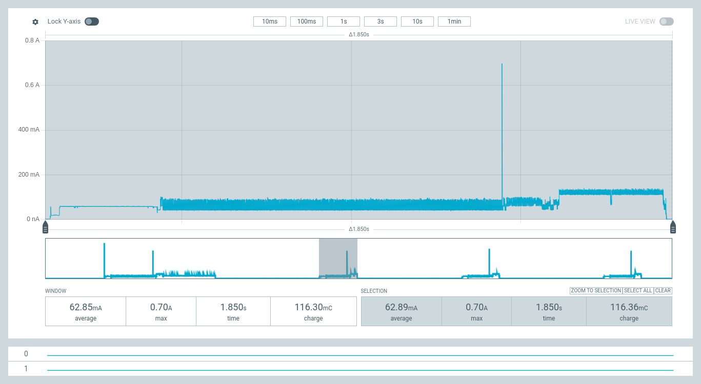


### Zoomed View of 0.7 A Peak Transient

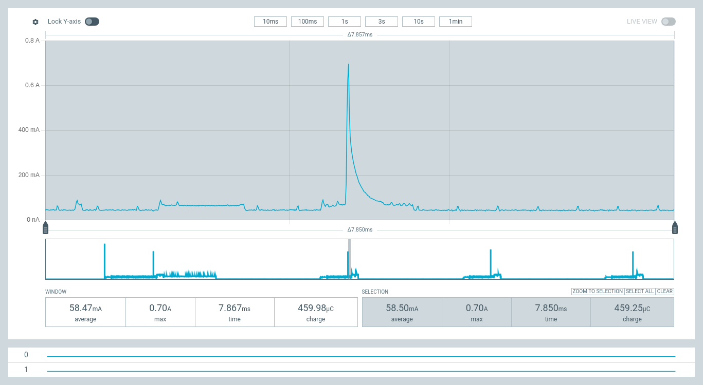


### Zoomed View of LoRa Packet TX

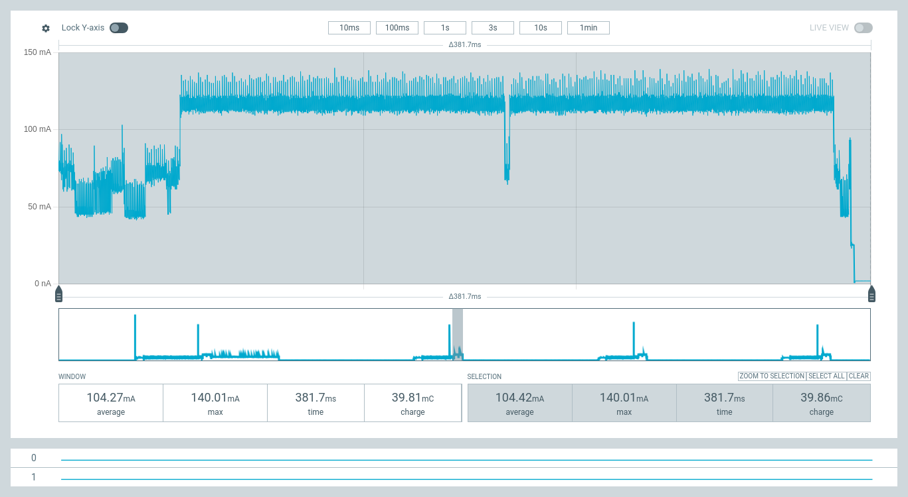


## Switch to RFM9x.sleep() (commit c7d0e89)

This is what the average deep sleep current looks like after I switched from
using `RFM9x.idle()` to `RFM9x.sleep()`. The average current drops to 41 µA,
which is a lot better, but hopefully it can still go lower.

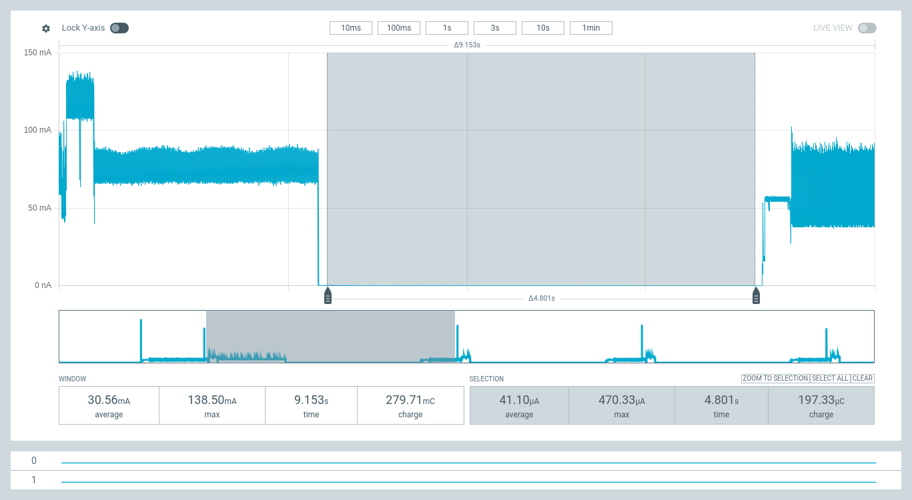


## Use MAX17048.hibernate() before sleep (commit d329866)

Putting the MAX17048 fuel gauge chip into hibernate mode drops another 8 µA off
the average deep sleep current, bringing it down to 33 µA. That's pretty good.


### Average Deep Sleep Current

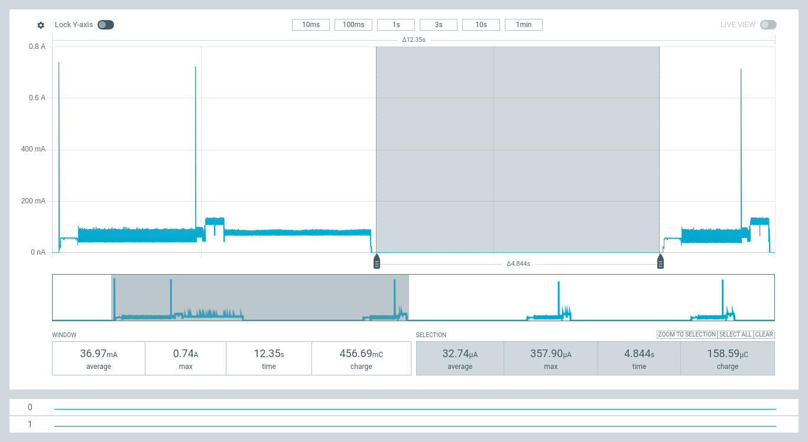


### Wake Cycle Total Charge

Total charge used for a wake cycle is currently 113.25 mC.

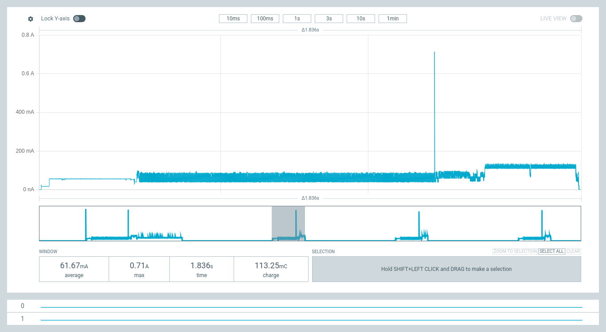


## Add Timing Markers (commit 68f1b43)

This adds gray code timing markers on A0 and A1 so it's possible to see in the
Nordic Power Profiler chart when boot.py, code.py, and the sensor's run()
function are active.

Interesting features:

1. Each wake cycle takes about 1.835 seconds. Of that, about the first 1.346 s
   is overhead that happens before boot.py starts running. The overhead section
   of the wake cycle uses about 66.2 mC of charge. The Python code section,
   including `boot.py` and `code.py` lasts for a total of about 489 ms and uses
   about 49 mC of charge.

2. From the start of `boot.py` to the start of `code.py` takes about 12 ms and
   uses about 733 µC of charge. This might include compile time for `code.py`,
   but I'm not sure about that.

3. From the start of `code.py` to the start of `sensor_mode.run()` takes 99 ms
   and uses 7.54 mC of charge. This might include compile time for
   `sensor_mode.py`.

4. From start to end of `sensor_mode.run()` takes about 371 ms and uses about
   40.6 mC of charge. That includes the charge to transmit two LoRa packets.

### Full Wake Cycle

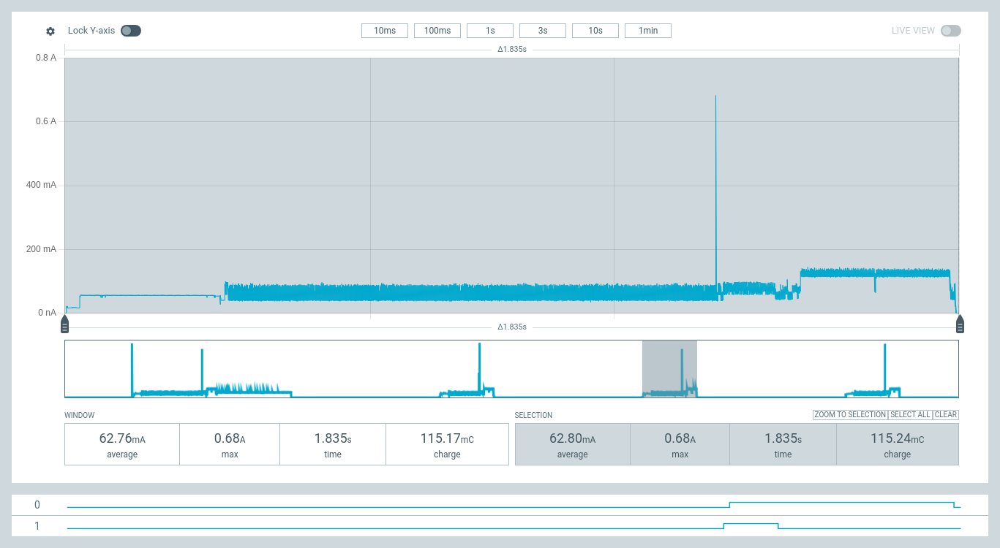


### Overhead Section Before boot.py

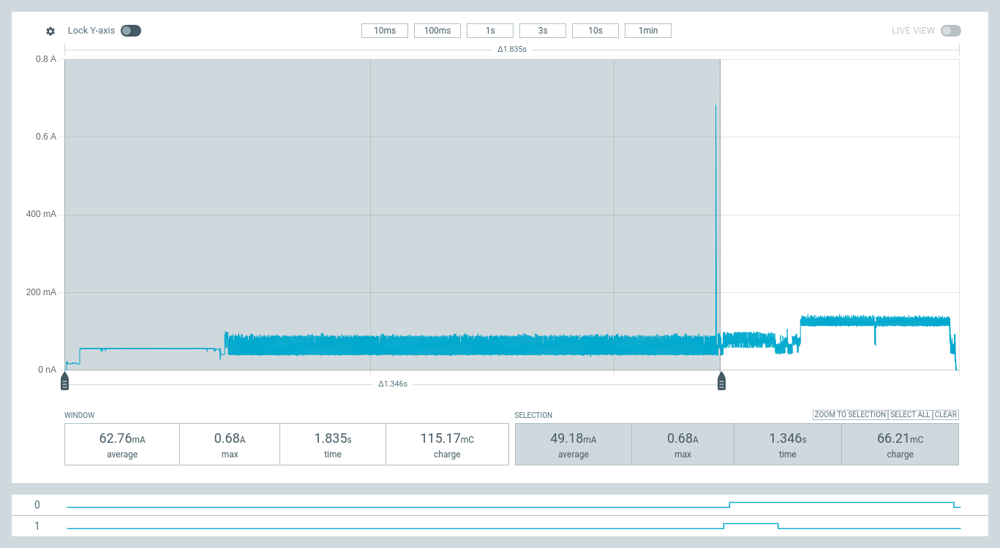


### Entire Code Section with boot.py and code.py

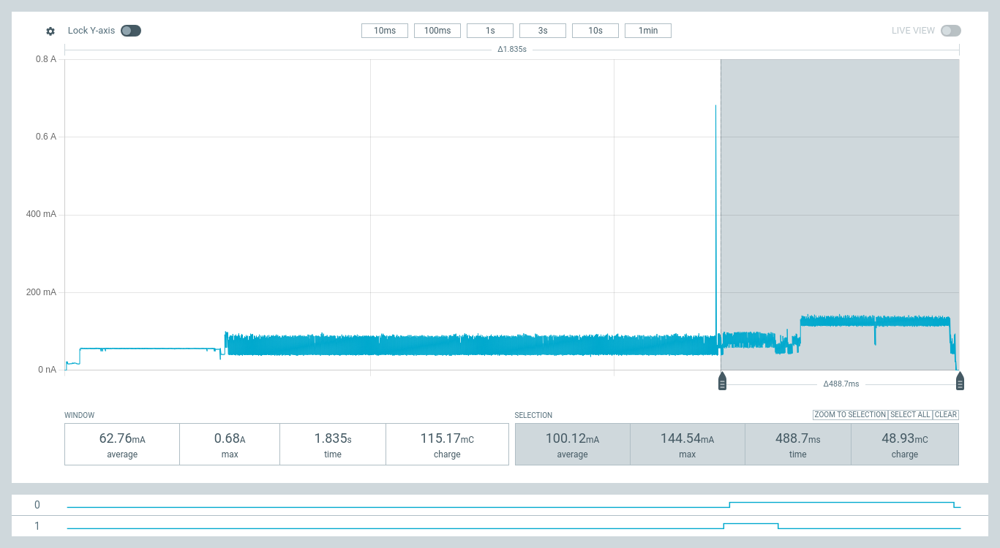


### Start of boot.py to Start of code.py

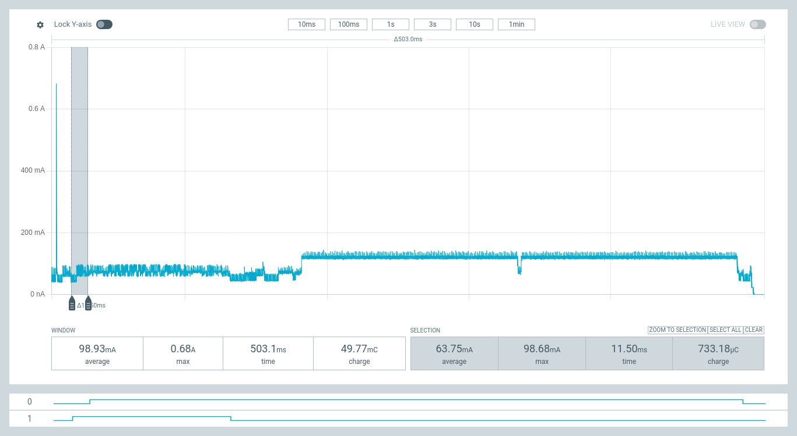


### Start of code.py to Start of sensor_mode.run()

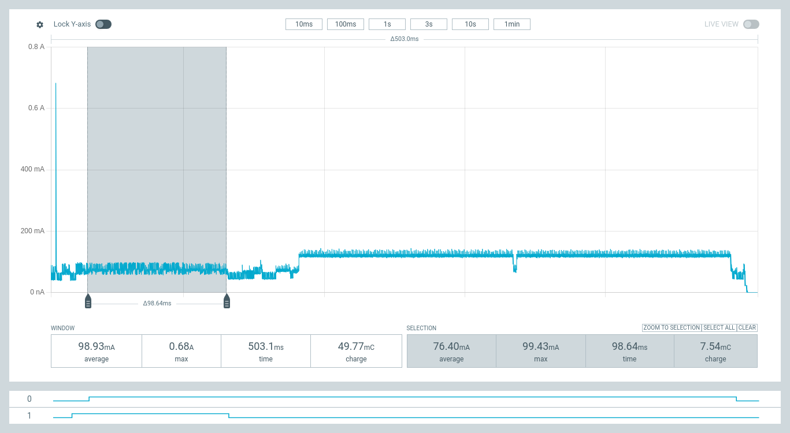


### Start to End of sensor_mode.run()

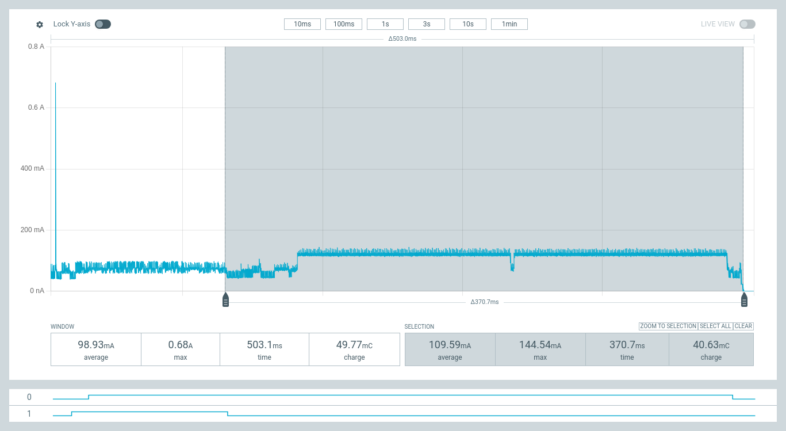


## Refactor 4 GPIO (commit b7bee97)

This time I added two more GPIO outputs to make it easier to examine each
major segment of code between `boot.py`, `code.py`, and `sensor_mode.py`.

This table summarizes my notes from Nordic Power Profiler:

```
GPIO
Bits  Segment        Duration     Charge
----  ------------   ----------   -------------
0001  boot.py
0011  code.py         11.42  ms       716.37 µC
0111  run()          127.3   ms     9.70     mC  # import sensor_mode
1111  I2C init         7.760 ms       728.25 µC
1101  LoRa init       19.63  ms     1.18     mC
1001  light sleep     39.71  ms     1.95     mC
0001  read sensors     2.90  ms       138.61 µC
0011  HMAC             2.80  ms       159.21 µC
0111  packet 1       155.6   ms    18.98     mC  # TX
1111  packet 2       154.7   ms    18.93     mC  # TX
0000  to-sleep        10.96  ms       513.77 µC
----  ------------   ----------   -------------
      Code Total     538.6   ms    53.14     mC
      Wake Cycle   1.890     s    119.88     mC
```

Interesting Features:

1. The 3 main time and charge intensive tasks are importing `sensor_mode.py`,
   transmitting the first packet, and transmitting the second packet.

2. The light sleep waiting for the temperature sensor sampling period to end
   takes about 2 mC, which is not that much compared to the compile and
   transmit Coulombs.

3. By far the majority of wake cycle Coulombs are spent on booting the VM
   before `boot.py` runs.


### Full Wake Cycle (1.890 s, 119.88 mC)

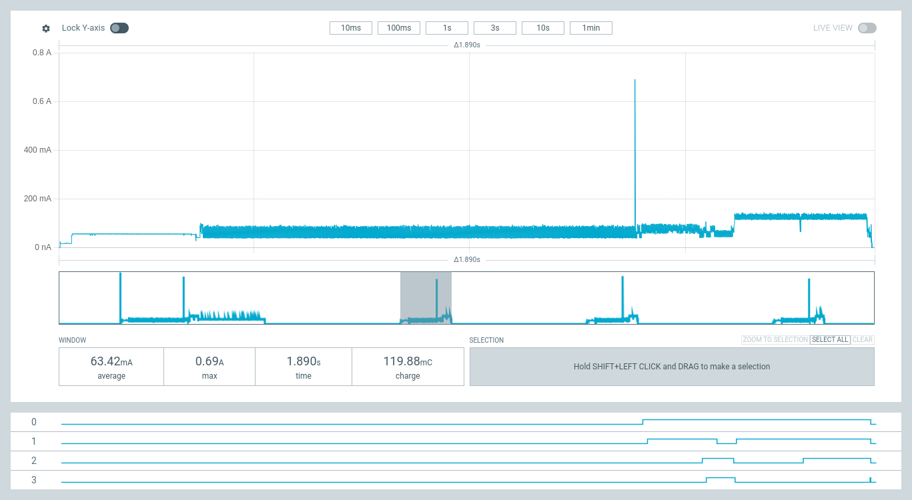


### Import sensor_mode.py (127.3 ms, 9.70 mC)

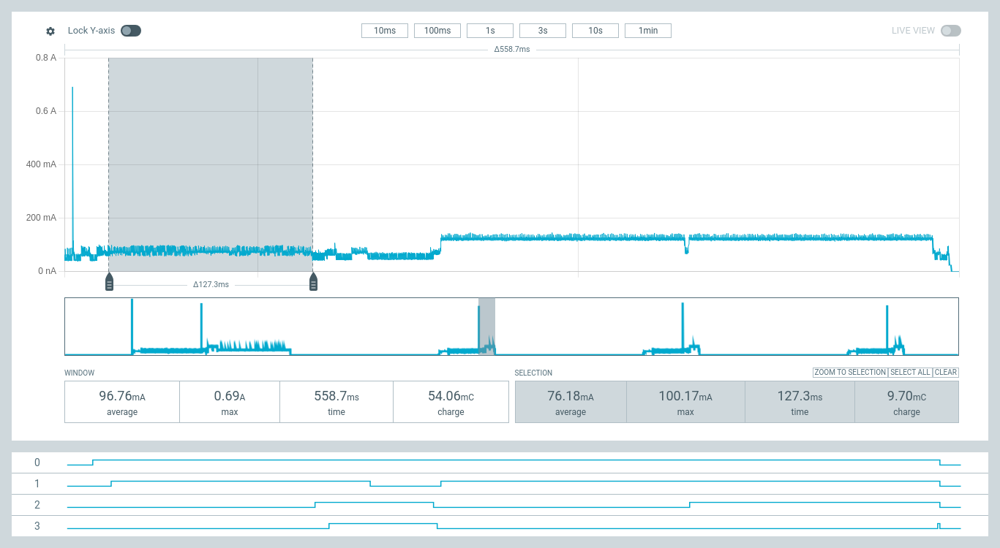


### Light Sleep (39.71 ms, 1.95 mC)

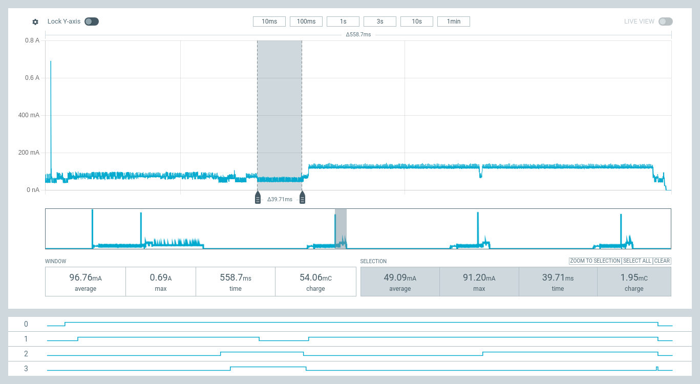


## Frequency 80 MHz (commit c09c6f3)

This reduces `microcontroller.cpu.frequency` from the default of 240 MHz down
to 80 MHz during `sensor_mode.run()`. The result is about +10ms increase in
code runtime with about -9 mC reduction in total charge used by the wake cycle.

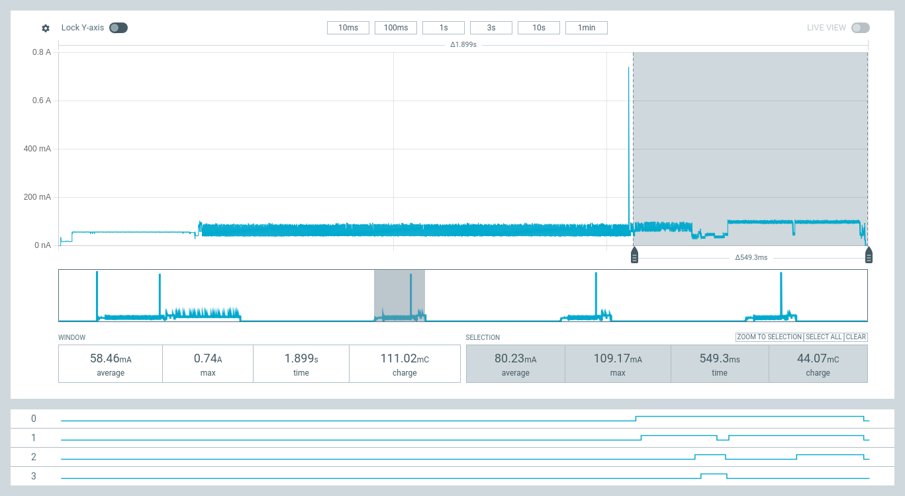


## Faster I2C and SPI Clocks (commit a42841b)

This shaves about 2.5 mC off each wake cycle by running the I2C and SPI bus
clocks a bit faster than what I had them set for previously.

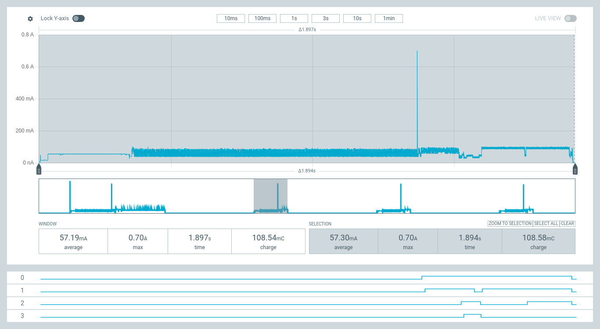


## LoRa TX Power 11 dB and Spreading Factor 8 (commit 6ed2bba)

Previously, I was using TX power 8 dB and spreading factor 9. This reduces the
spreading factor to 8 which should halve the on-air time and reduce receiver
sensitivity by about 3 dB (according to some chart I saw in The Things Network
LoRaWAN docs). To make up for the reduction in receiver sensitivity, I upped
the transmit power by a corresponding 3 dB to 11 dB (old level was 8 dB).

This change reduces the wake cycle time by about 131 ms and reduces the wake
cycle charge by about 10 mC (wake time 1.755 s, wake charge: 98.55 mC)


### Full Wake Cycle

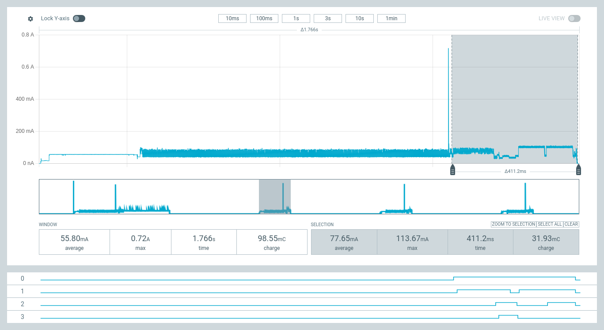


### Transmitting One Packet

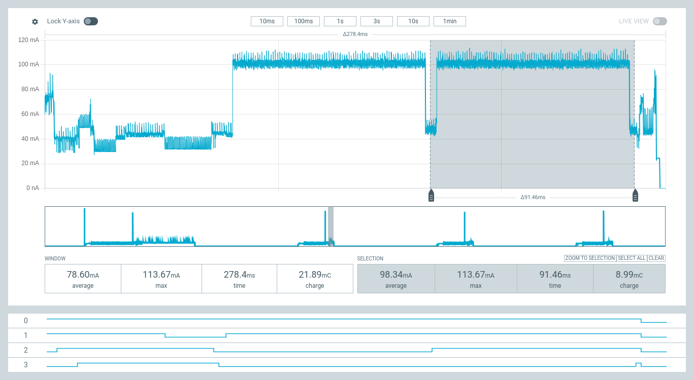


## LoRa TX Power 14 dB and Spreading Factor 7 (commit 39fc3ec)

This is like the last one, but again I reduced spreading factor by 1 and
increased transmit power by 3 dB. The new settings are TX power 14 dB and
spreading factor 7.

This change reduces the wake cycle time by about 90 ms and reduces the wake
cycle charge by about 8 mC (wake time 1.676 s, wake charge: 90.30 mC)


### Full Wake Cycle

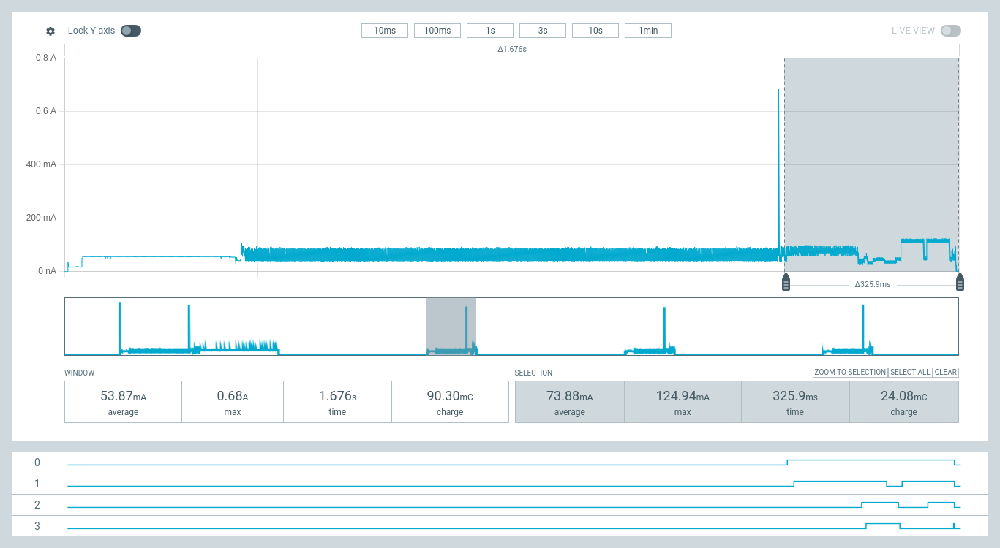


### Transmitting One Packet

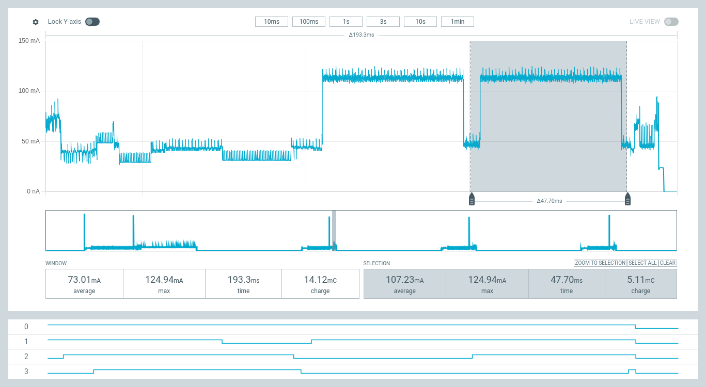


## Tune Clocks Again (commit 64fe119)

This time I reduced the I2C and SPI clocks a bit to 250 kHz I2C and 5 MHz SPI.
It seems like the combination of clock rates has some effect on the total deep
sleep charge between wake cycles. But, that all seems to be concentrated in a
short tail right when the wake cycle ends. If I ignore the tail, the deep sleep
current seems pretty consistent near an average of 21.9 µA.


### Wake Cycle

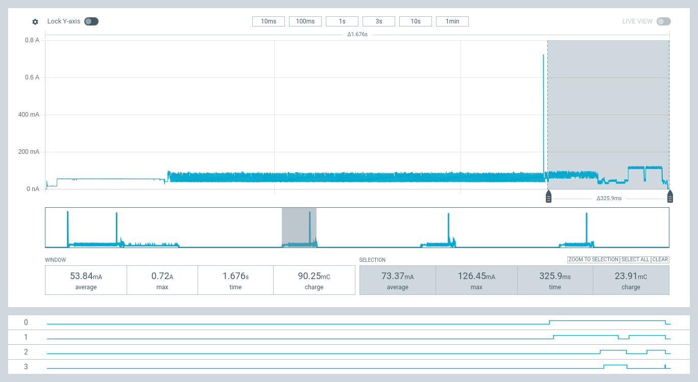


### Deep Sleeps Examples (average 21.9 µA)

Note how I start the selection a little after the end of the wake cycle to skip
the inconsistent tail current. Including the tail runs the average deep sleep
current up to the range of 23-30 µA, but that average is over 5 seconds. In
actual use, the deep sleep period will be a little under 20 minutes.

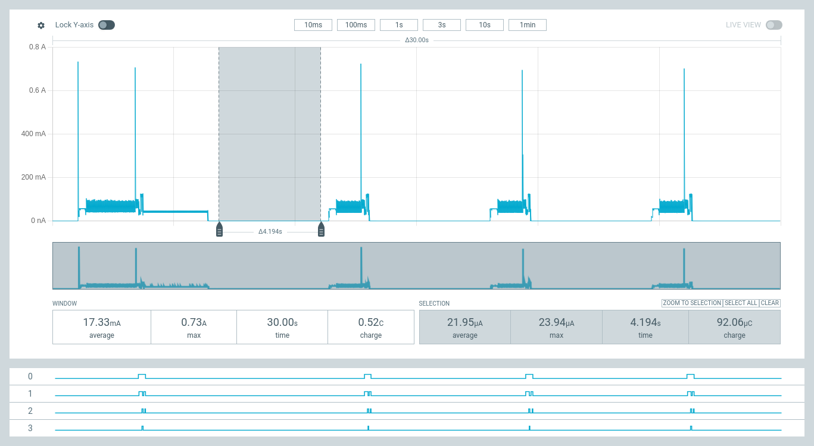

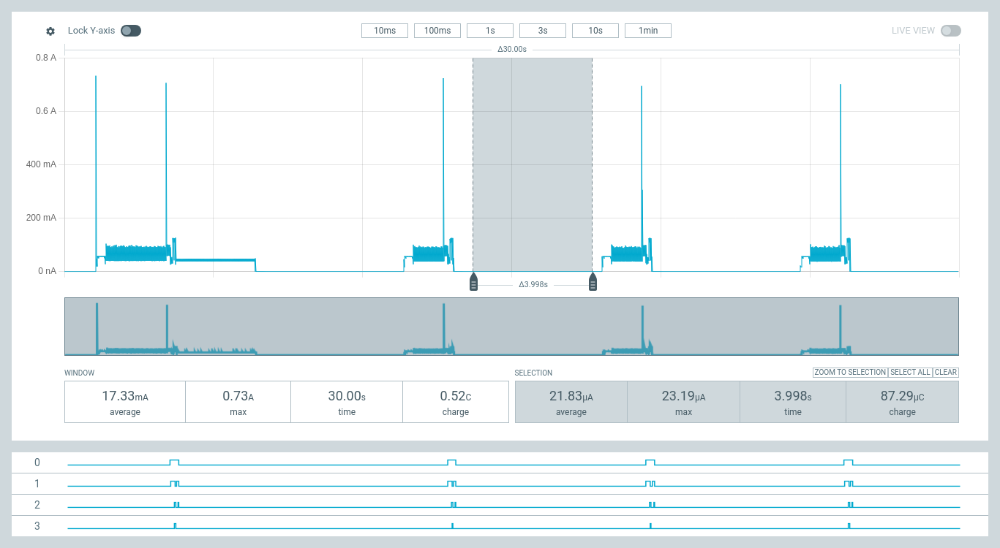

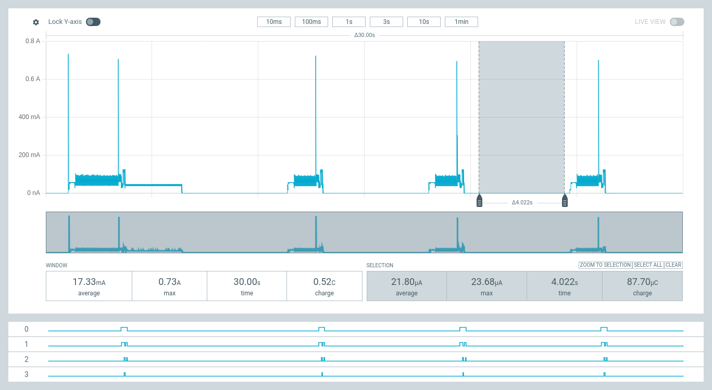


## Node Address & Stepped Transmit Power (commit 1807814)

This adds node address awareness and transmit interval jitter to the sensor and
base station firmware to prepare the system to work with multiple sensors. I
also added a transmit power step (10 dB then 16 dB) to help with range testing.

There's only a small increase in wake cycle time and charge used (+17ms and
+1.5 mC for total of 1.693 s, 91.77 mC).


### Full Wake Cycle, 91.77 mC

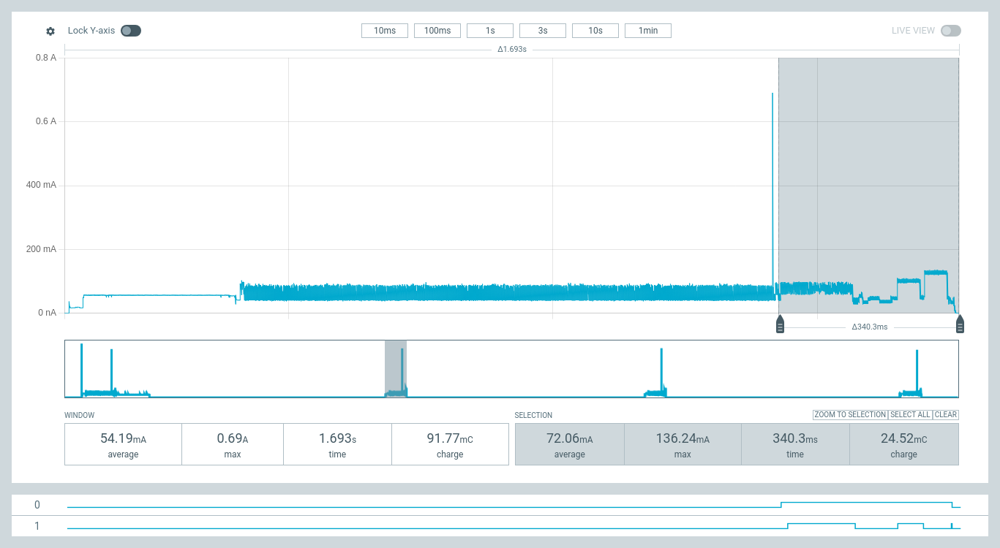


### Deep Sleep 21.99µA Average Current over 18 s

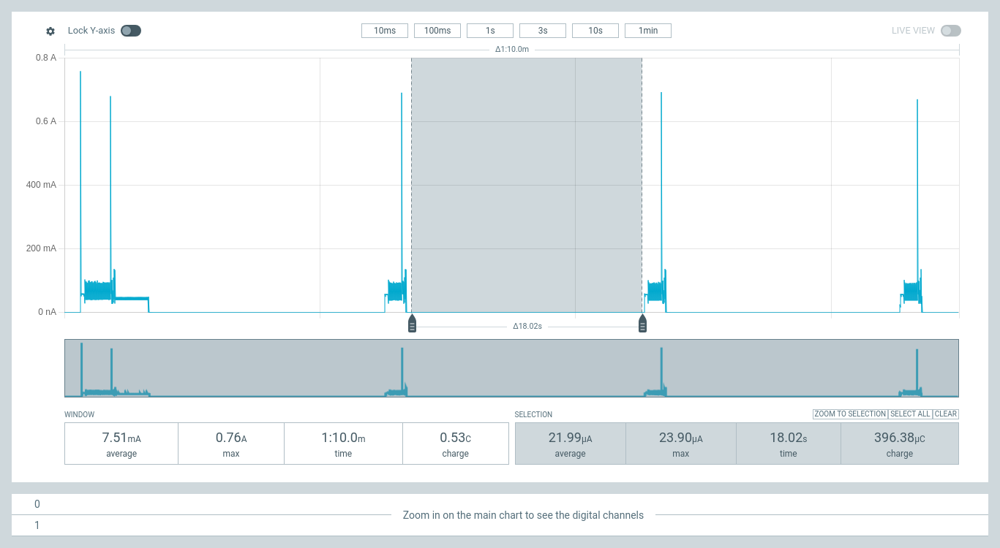


## Brownout Recovery Delay (commit e184714)

This adds some logic to make sure that I2C initializations don't happen too
quickly after boot or wake from deep sleep. The point is to let the I2C bus
recover from what appears to be a brownout. A current spike happens when the
CircuitPython supervisor switches on I2C_POWER before running boot.py and
code.py. On USB power, it doesn't matter. But, on a 400 mAh LiPo cell, my old
code was reporting invalid temperature measurements until I added more delay.


### Full Wake Cycle (1.867 s, 96.64 mC)

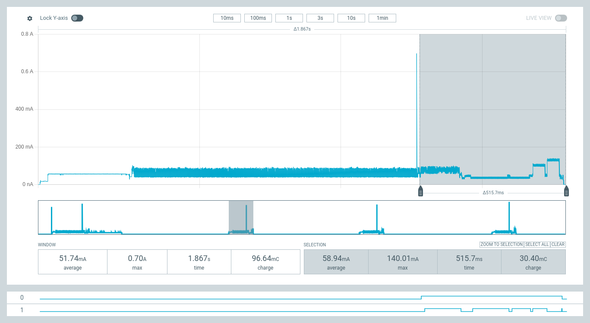


### Deep Sleep Current (22.32 µA)

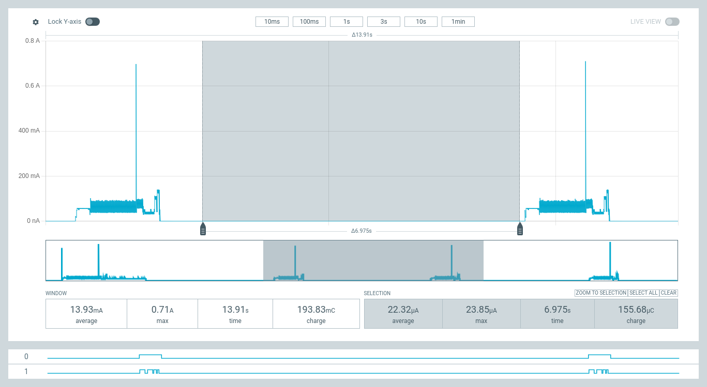


## More Power for Range Test (commit 06039b7)

This uses a range testing configuration with a stronger ramp of transmit
power steps compared to the previous configuration.

When I tried a range test for from the greenhouse (500m NLOS) with spreading
factor 7, none of the tx power 10dB packets made it. I received a few 16dB
packets while the transmitter was outside the greenhouse, but I got nothing
from the actual install location inside the greenhouse.

This configuration increases spreading factor from 7 to 8 which should increase
the effective signal strength by 3dB at the cost of extending the transmit time.
The tx power ramp is now three steps of 17dB, 20dB, and 23dB.

These changes increase the wake cycle time to 2.050 seconds, using 125.22 mC of
charge from the battery.

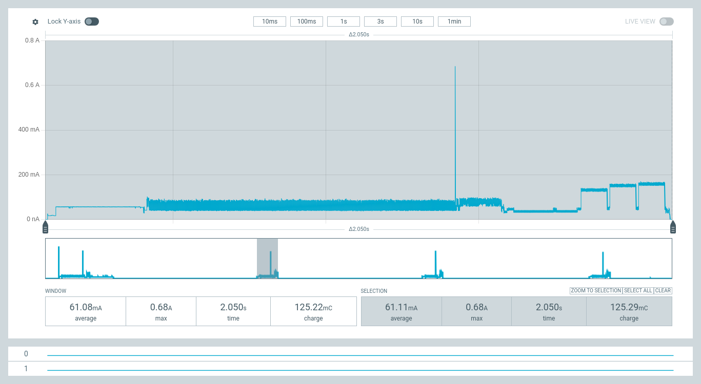


## Range Test Ramp 2 (commit 036715d)

This is to prepare for my second range test. The transmit power level ramp is
the same as for the last commit, but I added exception handling and some
configuration settings to make the testing process more practical. I also
wanted to get some good Power Profiler screenshots with the logic inputs
hooked up since I didn't bother to do that last time.


### Deep Sleep Average Current 22 µA

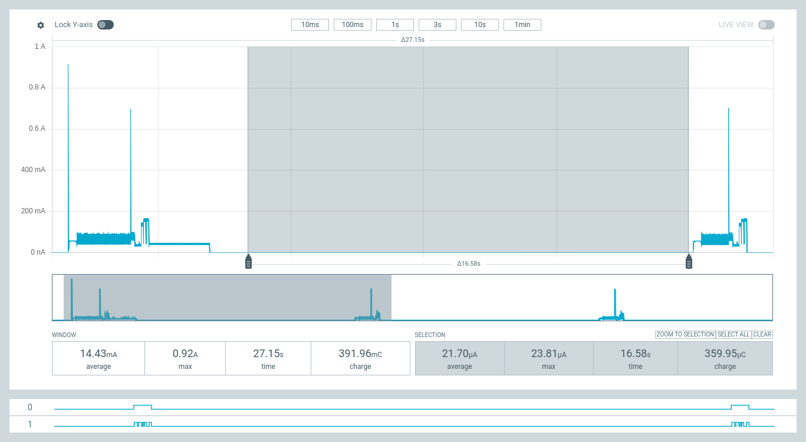


### Full Wake Cycle (2.054 s, 124.89 mC)

Here you can see a long period on the left for the VM to boot, some time for
boot.py and code.py, a longer time for importing sensor_mode.py, and then on
the right, sensor_mode.py running. The average current drops dramatically when
`sensor_mode.run()` drops the cpu frequency. The three square wave pulses on
the right are the ramp of three different RFM95 tx_power values.

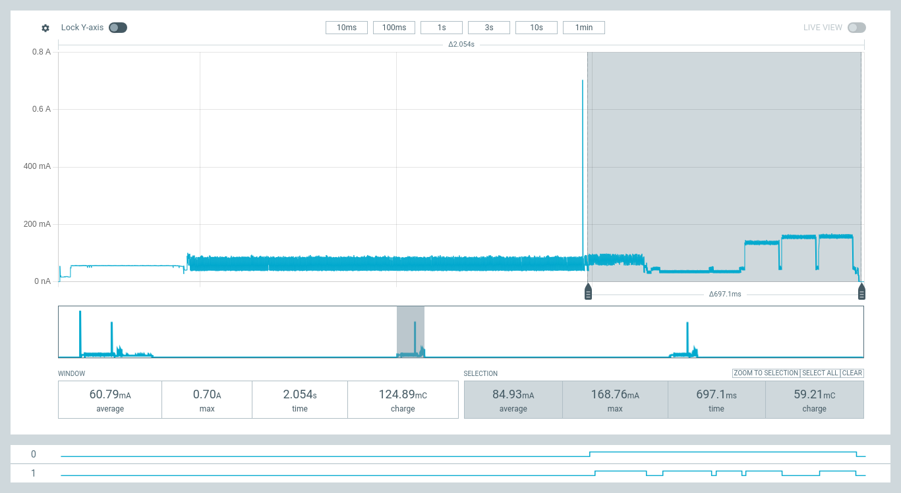


### Timing Markers During boot.py and code.py

You can compare the PPK2 logic port inputs ("0" and "1" at the bottom of the
screenshot) to places in
[boot.py](https://github.com/samblenny/lora-greenhouse-monitor/blob/036715db85b2e35603bd6a9cf21e46d9ba98db2b/boot.py),
[code.py](https://github.com/samblenny/lora-greenhouse-monitor/blob/036715db85b2e35603bd6a9cf21e46d9ba98db2b/code.py),
and [sensor_mode.py](https://github.com/samblenny/lora-greenhouse-monitor/blob/036715db85b2e35603bd6a9cf21e46d9ba98db2b/sensor_mode.py)
from commit 036715d where `a0.value` or `a1.value` are changed.

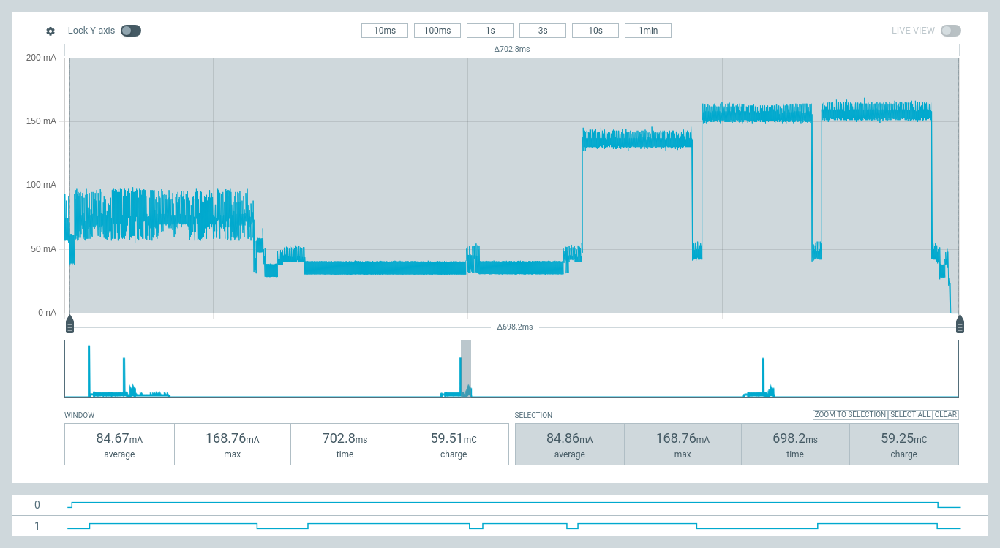


## Tune for Range (commit d7f0842)

After some field testing including a significant temperature change, it turned
out the previous LoRa tuning was too weak. This tune ups the spreading factor
from 8 to 10, the preamble length from 10 to 16, and the coding rate from 5 to
8. Instead of the previous range testing tx power ramp of 17, 20, and 23 dB,
this tune uses two 23 dB packets with a 5 ms delay between them.

As a result of all that, the charge per wake cycle goes up significantly from
124.89 mC for the old radio tune to 221.55 mC for the new tune. By my math,
with a 400 mAh LiPo and a transmit interval of 20 minutes, the current tune
should last for about 2 months before the battery gets down to 20% remaining
charge.


### Deep Sleep Average Current 22 µA

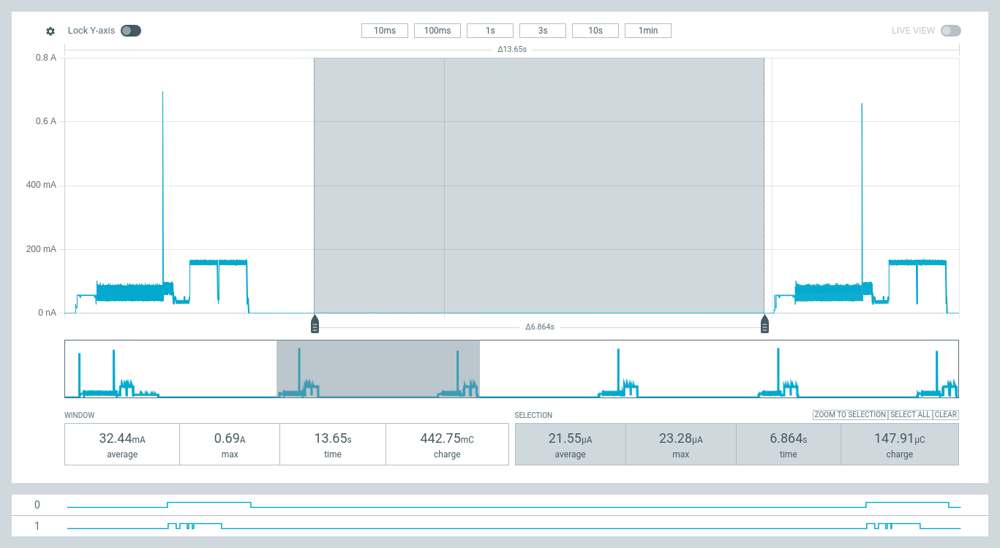


### Full Wake Cycle (2.667 s, 221.55 mC)

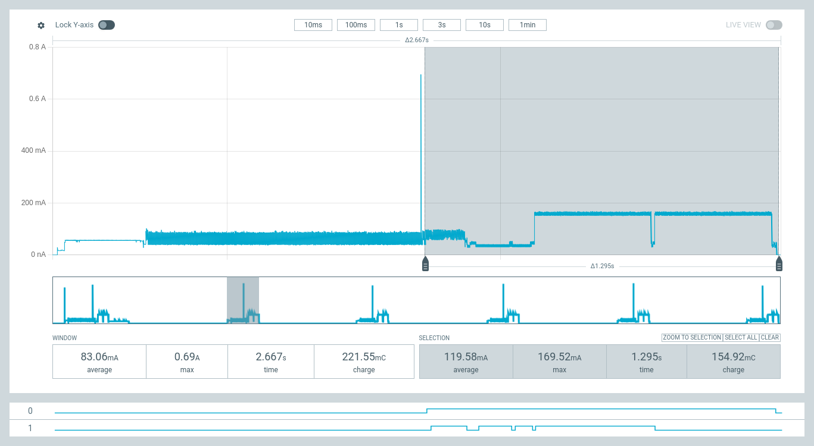
